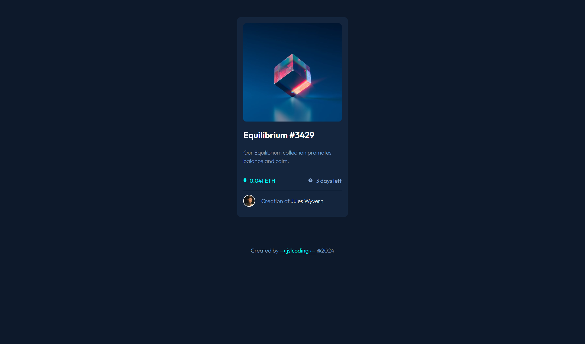

# Frontend Mentor - NFT preview card component solution
This is a solution to the [NFT preview card component challenge on Frontend Mentor](https://www.frontendmentor.io/challenges/nft-preview-card-component-SbdUL_w0U).  

## Table of contents

- [Overview](#overview)
  - [The challenge](#the-challenge)
  - [Screenshot](#screenshot)
  - [Links](#links)
  - [Built with](#built-with)
  - [Useful resources](#useful-resources)
- [Author](#author)

## Overview

### The challenge
Users should be able to:

- View the optimal layout depending on their device's screen size
- See hover states for interactive elements

### Screenshot

### Links
- Solution URL: [https://github.com/jslcoding/preview_card)
- Live Site URL: [https://jslcoding.github.io/preview_card/)

### Built with
- Semantic HTML5 markup
- CSS custom properties

### Useful resources
- [Image overlay](https://www.w3schools.com/howto/tryit.asp?filename=tryhow_css_image_overlay_opacity) - This helped me with image overlays

## Author
@jslcoding - jessica sanmartin limes
